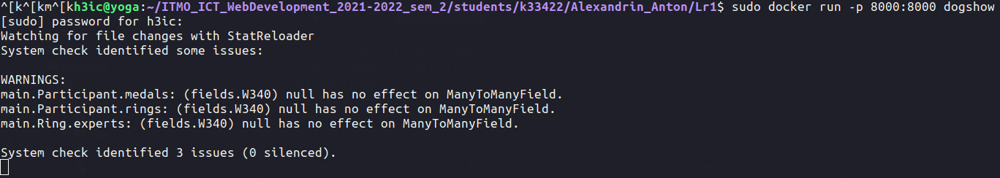
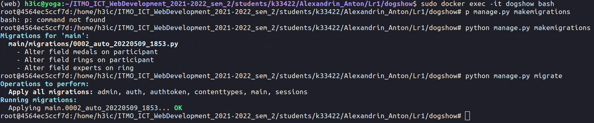

#### Задание:

1. Написать Dockerfile для запуска бэкенд части проекта из курса "Web-программирование".
2. Выполнить следующие действия:

- Изменить модель БД Django
- Зайти в контейнер и выполнить миграции (https://www.mousedc.ru/learning/565-komanda-docker-konteyner/)

### Backend Dockerfile

```dockerfile
FROM python:3.8.12

ENV docker_dog_app=/home/h3ic/ITMO_ICT_WebDevelopment_2021-2022_sem_2/students/k33422/Alexandrin_Anton/dogs/back
RUN mkdir -p $docker_dog_app/dogshow

WORKDIR $docker_dog_app/dogshow

COPY . $docker_dog_app

RUN pip install --upgrade pip
RUN pip install -r requirements.txt

EXPOSE 8000

CMD python manage.py runserver 0.0.0.0:8000
```

### Frontend Dockerfile

```dockerfile
FROM node:lts-alpine

ENV docker_dog_app=/home/h3ic/ITMO_ICT_WebDevelopment_2021-2022_sem_2/students/k33422/Alexandrin_Anton/dogs/front/dog_front

WORKDIR $docker_dog_app

COPY package*.json ./

RUN npm install

COPY . .

# RUN npm run build

EXPOSE 8080

CMD npm run serve
```

Запустим контейнер



Джанго подсказывает, что можно поправить в базе. Исправим эти моменты, перезапустим контейнер и выполним миграции:

