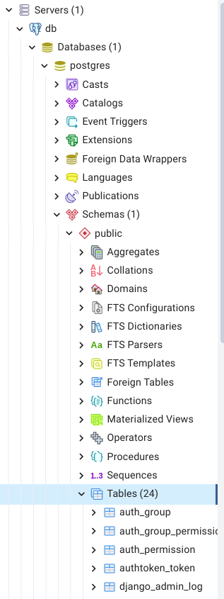

#### Задание:

1. Реализовать работу в оркестре всех сервисов из 3 и 4 работы из курса "Web-программирование".
2. Выполнить команды необходимые для того, чтобы добавить нового пользователя в БД Postgres. С попощью пользователя
   должна быть возможность подключиться к БД из приложения для работы с БД (Valentina DB).

### Docker-compose file

```yaml
version: '3'

services:
  back:
    container_name: dogs_back
    build: ./back
    command: bash -c "
      python3 manage.py makemigrations
      && python3 manage.py migrate
      && python3 manage.py runserver 0.0.0.0:8000";
    ports:
      - '8000:8000'
    depends_on:
      - db

  front:
    container_name: dogs_front
    build: ./front/dog_front
    ports:
      - '8080:8080'
    depends_on:
      - back

  db:
    container_name: dogs_db
    image: postgres
    environment:
      POSTGRES_DB: postgres
      POSTGRES_USER: postgres
      POSTGRES_PASSWORD: postgres
    ports:
      - '5432:5432'
    volumes:
      - ./dbs/postgres-data:/var/lib/postgresql

  pgadmin:
    container_name: pg_admin4
    image: dpage/pgadmin4
    environment:
      PGADMIN_DEFAULT_EMAIL: postgres@user.com
      PGADMIN_DEFAULT_PASSWORD: postgres
    ports:
      - '5050:80'
    depends_on:
      - db

volumes:
  pgdata:
```

Для подключения postgresql изменим конфигурацию в settings.py:

```python
DATABASES = {
   'default': {
       'ENGINE': 'django.db.backends.postgresql_psycopg2',
       'NAME': 'postgres',
       'USER': 'postgres',
       'PASSWORD': 'postgres',
       'HOST': 'db',
       'PORT': '5432',
   }
}
```

С credentials указанного в compose-файле пользователя подключимся к pgadmin, запущенному на порте 5050


Доступ к БД получен:

