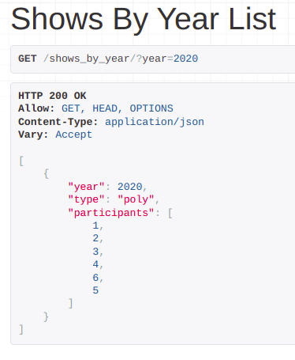
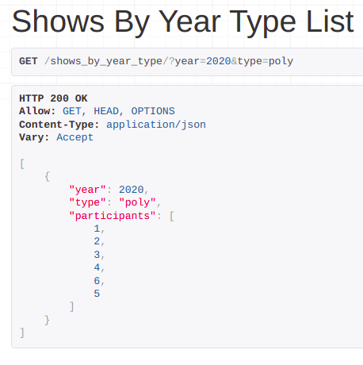
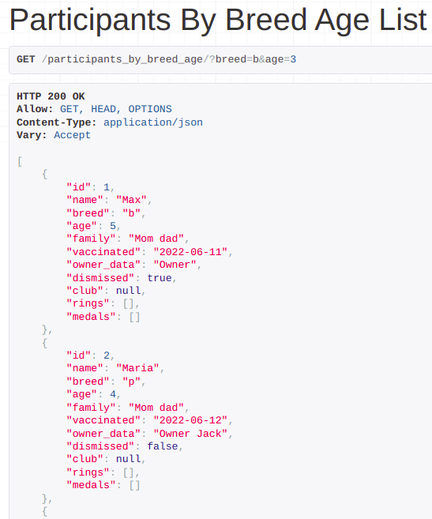

#### Задание 2.1.1

Реализвать в ручную следующие фильтры (в ручную значит, что Вам необходимо передать в url параметры, далее переопределть метод list или get_queryset, c целью взять параметры из url-адреса, выполнить с ними запрос и вернуть responce пользователю):

- принимает параметр из url-адреса и выводит отфильтрованные данные.  (GET, ListAPIView)
- принимает 2 параметра из url-адреса и выводит отфильтрованные данные. (GET, ListAPIView)
- принимает 2 параметра из url-адреса и выводит отфильтрованные данные, если пользователь авторизован и неотфильтрованные, если не авторизован. (GET, ListAPIView)

Эндпоинты:

```
  path('shows_by_year/', ShowsByYearListView.as_view()),
  path('shows_by_year_type/', ShowsByYearTypeListView.as_view()),
  path('participants_by_breed_age/', ParticipantsByBreedAgeListView.as_view())
```

##### Фильтрация выставок по году:

```
class ShowsByYearListView(generics.ListAPIView):
    serializer_class = ShowSerializer

    def get_queryset(self):
        queryset = Show.objects.all()
        year = self.request.query_params.get('year')

        if year:
            queryset = queryset.filter(year=year)

        return queryset
```



##### Фильтрация выставок по году и типу выставок (моно- и полипородные):

```
class ShowsByYearTypeListView(generics.ListAPIView):
    serializer_class = ShowSerializer

    def get_queryset(self):
        queryset = Show.objects.all()
        year = self.request.query_params.get('year')
        type_ = self.request.query_params.get('type')

        print(year, type_)

        if year and type_:
            queryset = queryset.filter(year=year, type=type_)

        return queryset
```



##### Фильтрация участников по породе и возрасту:

```
class ParticipantsByBreedAgeListView(generics.ListAPIView):
    serializer_class = ParticipantSerializer

    def get_queryset(self):
        queryset = Participant.objects.all()
        user = self.request.user

        if user.is_authenticated:
            breed = self.request.query_params.get('breed')
            age = self.request.query_params.get('age')
            if breed and age:
                queryset = queryset.filter(breed=breed, age=age)

        return queryset
```

