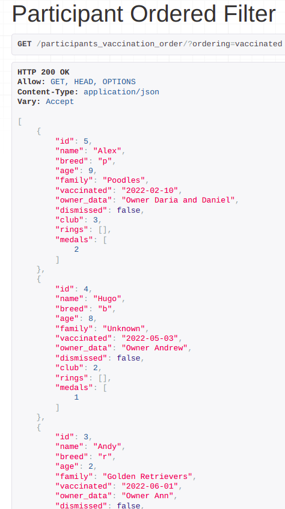
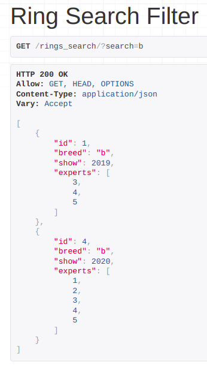
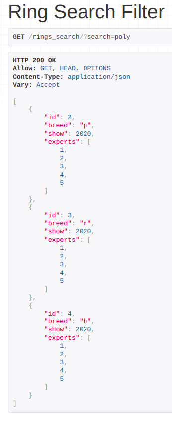
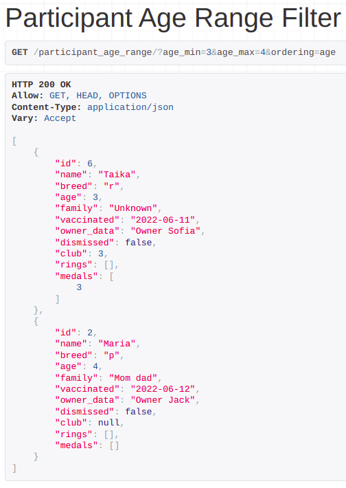

#### Задание 2.1.2

Реализвать в ручную следующие фильтры (Необходимо использовать библиотеку django-filters:

- сортировка по дате, поиск, поиск по полям из связной таблицы
- сортировка в диапазоне цен, дат или каких-либо других числовых значений

##### Регистрируем django-filters и добавляем методы фильтрации по умолчанию:

```python
'DEFAULT_FILTER_BACKENDS':
        ['django_filters.rest_framework.DjangoFilterBackend']
```

##### Сортировка участников по дате вакцинации:

```python
class ParticipantOrderedFilterView(generics.ListAPIView):
    queryset = Participant.objects.all()
    serializer_class = ParticipantSerializer
    filter_backends = (filters.OrderingFilter,)
    filterset_fields = 'vaccinated'
```



##### Фильтрация рингов по породе и по типу шоу, в котором был представлен ринг:

```python
class RingSearchFilterView(generics.ListAPIView):
    queryset = Ring.objects.all()
    serializer_class = RingSerializer
    filter_backends = (filters.SearchFilter,)
    search_fields = ('breed', 'show__type')
```





##### Фильтрация по возрасту в заданном промежутке:

```python
class ParticipantAgeRangeFilterView(generics.ListAPIView):
    queryset = Participant.objects.all()
    serializer_class = ParticipantSerializer
    filterset_class = ParticipantAgeRangeFilter
```


