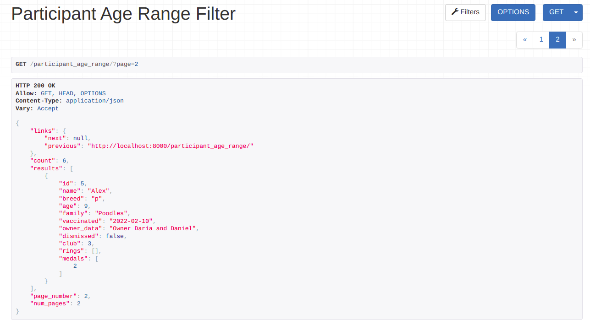

#### Задание 2.2.2

Написать и применить метод пагинации, который, кроме обычного вывода вернет количество страниц пагинации и номер текущей страницы

Кастомный класс пагинации:

```python
from rest_framework import pagination
from rest_framework.response import Response

class CustomPagination(pagination.PageNumberPagination):
    def get_paginated_response(self, data):
        return Response({
            'links': {
                'next': self.get_next_link(),
                'previous': self.get_previous_link()
            },
            'count': self.page.paginator.count,
            'results': data,
            'page_number': self.page.number,
            'num_pages': self.page.paginator.num_pages,
        })
```

##### Добавим во вью с выводом участников пагинацию:

```python
class ParticipantAgeRangeFilterView(generics.ListAPIView):
    queryset = Participant.objects.all()
    serializer_class = ParticipantSerializer
    filterset_class = ParticipantAgeRangeFilter
    
    pagination_class = CustomPagination
```

