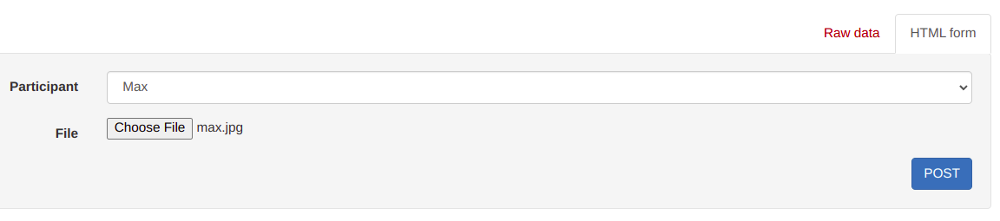
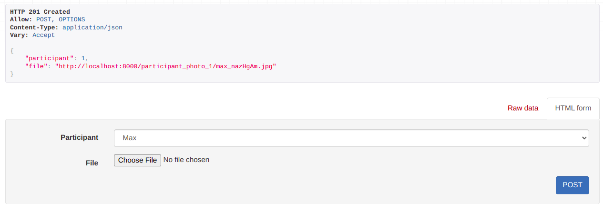
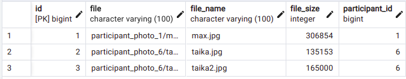
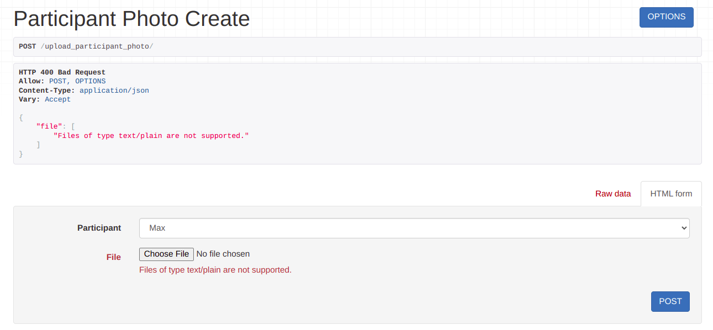
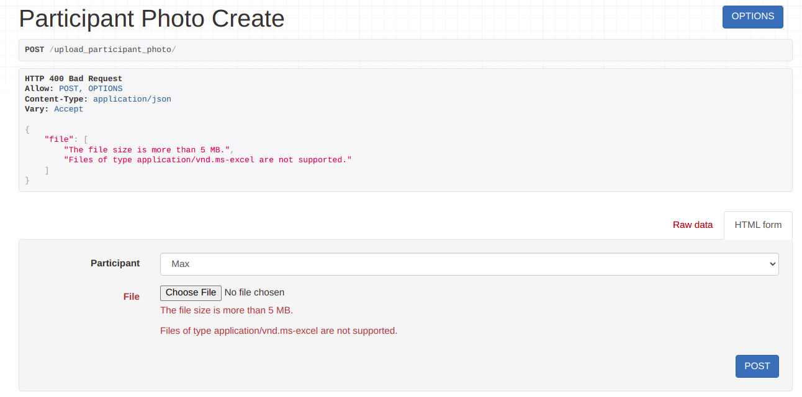

#### Задание 2.3.1

Реализовать следующие ендпоинты:

- Ендпоинт для загрузки файлов, с указанием внешнего ключа на связный объект и сохранением имени и размера файла в базе данных.
- Ендпоинт для сохранения нескольких файлов и валидации на максимальный размер файла и доступные для загрузки расширения файлов.

### Модель файла - изображения участника:

```python
def get_upload_path(instance, filename):
    return f'participant_photo_{instance.participant.id}/{filename}'


class ParticipantPhoto(models.Model):
    participant = models.ForeignKey('Participant',
                                    on_delete=models.CASCADE,
                                    related_name='participant_photos')
    file = models.FileField(
        validators=[validate_file_size, validate_file_type],
        upload_to=get_upload_path
    )
    file_name = models.CharField(max_length=100, blank=True, null=True)
    file_size = models.IntegerField(blank=True, null=True)

    def __str__(self):
        return f'Photo of {str(self.participant)}'

    def save(self, *args, **kwargs):
        self.file_name = self.file.name
        self.file_size = self.file.size
        super(ParticipantPhoto, self).save(*args, **kwargs)
```

### Валидаторы:

```python
def validate_file_size(file):
    MAX_MB = 5
    limit = MAX_MB * 1024 * 1024

    if file.size > limit:
        raise ValidationError(f'The file size is more than {MAX_MB} MB.')


def validate_file_type(file):
    photo_extensions = ['image/png', 'image/jpeg']

    content_type = magic.from_buffer(file.read(), mime=True)
    if content_type not in photo_extensions:
        raise ValidationError(f'Files of type {content_type} are not supported.')
```

### Сериализатор:

```python
class ParticipantPhotoSerializer(serializers.ModelSerializer):

    class Meta:
        model = ParticipantPhoto
        fields = ['participant', 'file']
```

### Вью для загрузки одного файла:

```python
class ParticipantPhotoCreateView(generics.CreateAPIView):
    queryset = ParticipantPhoto.objects.all()
    serializer_class = ParticipantPhotoSerializer
```

### Вью для загрузки нескольких файлов:

```python
class MultipleParticipantPhotoCreateView(generics.CreateAPIView):
    queryset = ParticipantPhoto.objects.all()
    serializer_class = ParticipantPhotoSerializer

    def post(self, request, *args, **kwargs):
        files = request.FILES.getlist('file')

        for file in files:
            participant_id = request.POST.get('participant')
            file = ParticipantPhoto(
                participant=Participant.objects.get(id=participant_id),
                file=file)
            file.save()

        return Response(str(request.data), status=status.HTTP_201_CREATED)
```

### Загрузка одного файла:





### Загрузка двух файлов:




### Ошибки:



