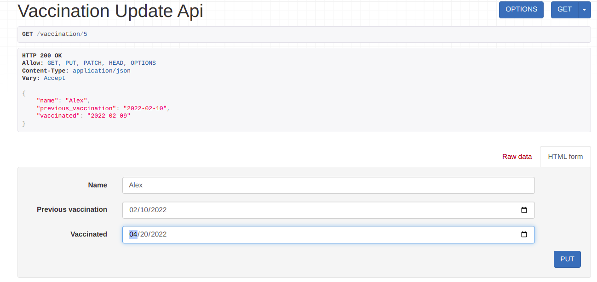
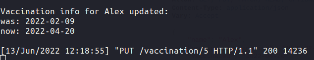
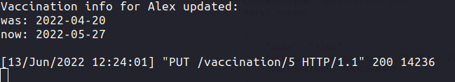
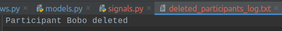

#### Задание 2.4.1

Реализовать 3 сигнала, которые:

- Вызывает логику, во время создания экземаляра объекта.
- Сохраняет значения выбранных полей в таблице в специальные поля для хранения предыдущих значений при обновлении объекта.
- При удалении объекта записывает информацию об удалении в лог реализованный любым образом.

### Для регистрации сигналов добавим конфигурацию ready в apps.py:

```python
class MainConfig(AppConfig):
    default_auto_field = 'django.db.models.BigAutoField'
    name = 'main'

    def ready(self):
        from . import signals
```

### Сигнал 1: создание участника:

```python
@receiver(post_save, sender=Participant)
def create_participant(sender, instance, created, **kwargs):
    if created:
        print(f'Participant {instance.name} created\n')
```


### Сигнал 2: обновление данных о вакцинации:

В модель участника добавлено поле previous_vaccination

```python
@receiver(pre_save, sender=Participant)
def update_participant_vaccination(sender, instance, **kwargs):
    prev_instance = Participant.objects.get(id=instance.id)
    instance.previous_vaccination = prev_instance.vaccinated
    print(f'Vaccination info for {instance.name} updated: \n'
          f'was: {instance.previous_vaccination}\n'
          f'now: {instance.vaccinated}\n')
```





#### Если поменять дату еще раз:



### Сигнал 3: удаление участника и логирование:

```python
@receiver(pre_delete, sender=Participant)
def delete_participant(sender, instance, **kwargs):
    with open('deleted_participants_log.txt', 'a') as f:
        f.write(f'Participant {instance.name} deleted\n')
```

