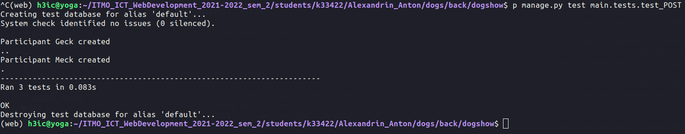

### Создание медали

```python
class CreateMedalTest(TestCase):

    def test_create_medal(self):
        url = reverse('main:create_medal')

        data = {
            'id': 1,
            'medal': 'g'
        }

        response = self.client.post(url, data, format='json')
        self.assertEqual(response.status_code, status.HTTP_201_CREATED)
        self.assertEqual(response.json(), data)
```

### Добавление участника со связанным объектом - Клубом

```python

class CreateParticipantTest(TestCase):

    @classmethod
    def setUpTestData(cls):
        Club.objects.create(
            id=1,
            name='Duck'
        )

    def test_create_participant(self):
        url = reverse('main:create_participant')

        data = {
            'id': 1,
            'name': 'Meck',
            'breed': 'r',
            'age': 5,
            'family': 'Unknown',
            'previous_vaccination': '2021-05-06',
            'vaccinated': '2022-05-06',
            'owner_data': 'Unknown',
            'dismissed': False,
            'medals': [],
            'rings': [],
            'club': 1
        }
        response = self.client.post(url, data, format='json')
        self.assertEqual(response.status_code, status.HTTP_201_CREATED)
        self.assertEqual(response.json(), data)
```
        
### Добавление оценки участника на конкретном ринге от конкретного эксперта
### (Ринг связан с выставкой)

```python
class CreateGradeTest(TestCase):

    @classmethod
    def setUpTestData(cls):
        Participant.objects.create(
            id=1,
            name='Geck',
            breed='p',
            age=5,
            family='Unknown',
            vaccinated='2022-06-05',
            owner_data='Unknown',
            dismissed=False
        )

        Expert.objects.create(
            id=1,
            name='Алиса',
            last_name='Ушкина',
            club='Tails'
        )

        Show.objects.create(
            year=2001,
            type='mono',
        )

        Ring.objects.create(
            id=1,
            show=Show.objects.get(year=2001),
            breed='r'
        )

        Grade.objects.create(
            id=2,
            participant=Participant.objects.get(id=1),
            ring=Ring.objects.get(id=1),
            expert=Expert.objects.get(id=1),
            final_grade=5
        )

    def test_create_grade(self):
        url = reverse('main:create_grade')

        show = Show.objects.get(year=2001)
        participant = Participant.objects.get(id=1)
        expert = Expert.objects.get(id=1)
        ring = Ring.objects.get(id=1)

        show.participants.add(participant)
        ring.experts.add(expert)

        data = {
            'id': 1,
            'participant': 1,
            'ring': 1,
            'expert': 1,
            'final_grade': 5
        }

        response = self.client.post(url, data, format='json')
        self.assertEqual(response.status_code, status.HTTP_201_CREATED)
        self.assertEqual(response.json(), data)
```

