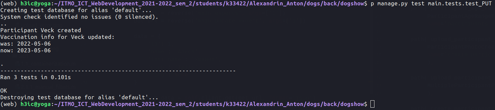

### Обновление клуба,  в котором состоит эксперт

```python
class UpdateExpertClubTest(TestCase):

    @classmethod
    def setUpTestData(cls):
        Expert.objects.create(
            id=1,
            name='Алиса',
            last_name='Ушкина',
            club='Tails',
            ring=None
        )

    def test_update_club(self):
        get_url = reverse('main:experts', args=['1'])
        put_url = reverse('main:update_expert', args=['1'])

        data = {
            'id': 1,
            'name': 'Алиса',
            'last_name': 'Ушкина',
            'club': 'Tails',
            'ring': None
        }

        current_data = self.client.get(get_url, format='json')
        self.assertEqual(current_data.status_code, status.HTTP_200_OK)
        self.assertEqual(current_data.json(), data)

        data['club'] = 'Royal'

        self.client.put(put_url, data, content_type='application/json')
        changed_data = self.client.get(get_url, format='json')
        self.assertEqual(changed_data.status_code, status.HTTP_200_OK)
        self.assertEqual(changed_data.json(), data)
```

### Обновление даты вакцинации. Сигнал обновляет предыдущую дату, это также тестируется

```python
class UpdateVaccinationTest(TestCase):

    @classmethod
    def setUpTestData(cls):
        Club.objects.create(
            id=1,
            name='Duck'
        )

        Participant.objects.create(
            id=1,
            name='Veck',
            breed='r',
            age=5,
            family='Unknown',
            previous_vaccination='2021-05-06',
            vaccinated='2022-05-06',
            owner_data='Unknown',
            dismissed=False,
            club=Club.objects.get(id=1)
        )

    def test_update_vaccination(self):
        get_url = reverse('main:participants', args=['1'])
        put_url = reverse('main:update_vaccination', args=['1'])

        data = {
            'id': 1,
            'name': 'Veck',
            'breed': 'r',
            'age': 5,
            'family': 'Unknown',
            'previous_vaccination': '2021-05-06',
            'vaccinated': '2022-05-06',
            'owner_data': 'Unknown',
            'dismissed': False,
            'medals': [],
            'rings': [],
            'club': 1
        }

        current_data = self.client.get(get_url, format='json')
        self.assertEqual(current_data.status_code, status.HTTP_200_OK)
        self.assertEqual(current_data.json(), data)

        data['vaccinated'] = '2023-05-06'
        data['previous_vaccination'] = '2022-05-06'

        self.client.put(put_url, data, content_type='application/json')
        changed_data = self.client.get(get_url, format='json')
        self.assertEqual(changed_data.status_code, status.HTTP_200_OK)
        self.assertEqual(changed_data.json(), data)
```

### Обновление ринга (объекта из связного списка), на котором работал эксперт

```python
class UpdateExpertRingTest(TestCase):

    @classmethod
    def setUpTestData(cls):
        Show.objects.create(
            year=2001,
            type='mono',
        )

        Ring.objects.create(
            id=1,
            show=Show.objects.get(year=2001),
            breed='r'
        )

        Ring.objects.create(
            id=2,
            show=Show.objects.get(year=2001),
            breed='p'
        )

        Expert.objects.create(
            id=1,
            name='Алиса',
            last_name='Ушкина',
            club='Tails',
            ring=Ring.objects.get(id=1)
        )

    def test_update_ring(self):
        get_url = reverse('main:experts', args=['1'])
        put_url = reverse('main:update_expert', args=['1'])

        data = {
            'id': 1,
            'name': 'Алиса',
            'last_name': 'Ушкина',
            'club': 'Tails',
            'ring': 1
        }

        current_data = self.client.get(get_url, format='json')
        self.assertEqual(current_data.status_code, status.HTTP_200_OK)
        self.assertEqual(current_data.json(), data)

        data['ring'] = 2

        self.client.put(put_url, data, content_type='application/json')
        changed_data = self.client.get(get_url, format='json')
        self.assertEqual(changed_data.status_code, status.HTTP_200_OK)
        self.assertEqual(changed_data.json(), data)
```

