#### Задание 4

Необходимо реализовать интерфейс списков объектов, в котором подключить фильтры из второй лабораторной. В интерфейсе должен быть обеспечен следующий функционал:

- сортировка объектов.
- пагинация.
- поиск по объектам.
- фильтрация с чекбоксами.
- фитры на диапазон.

### Сортировка участников по дате вакцинации:

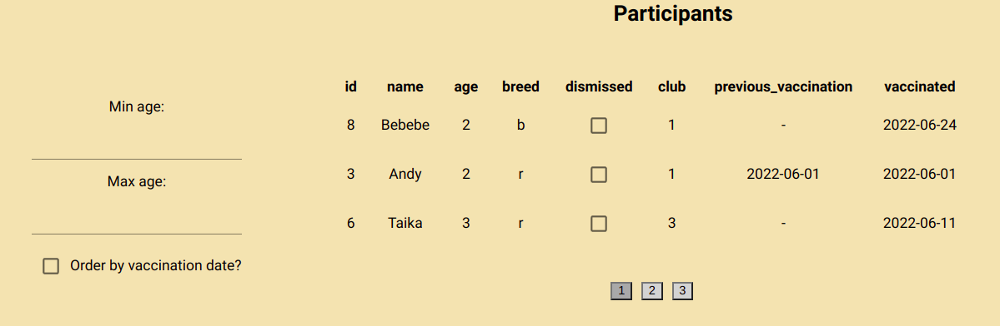

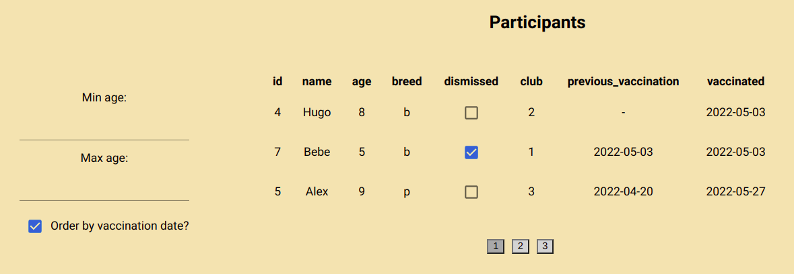

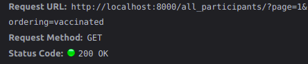

### Фильтрация участников по возрастному диапазону:

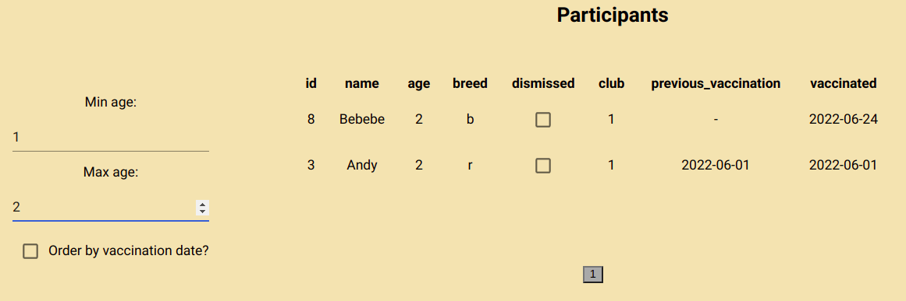

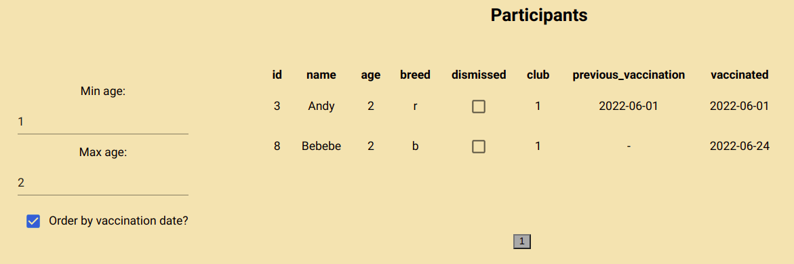

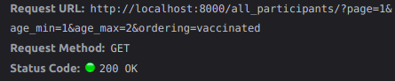

### Пагинация в таблице с экспертами:

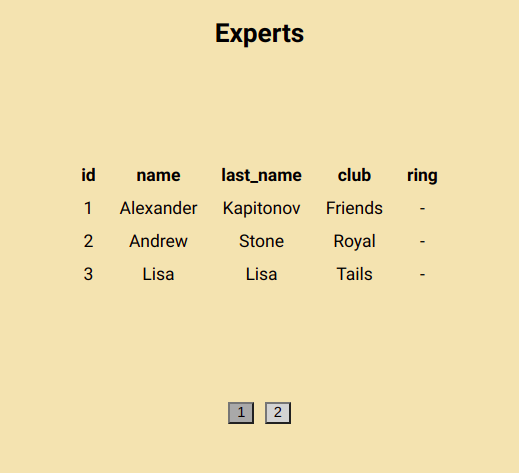

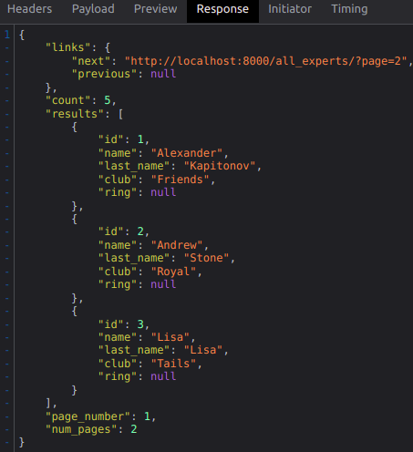

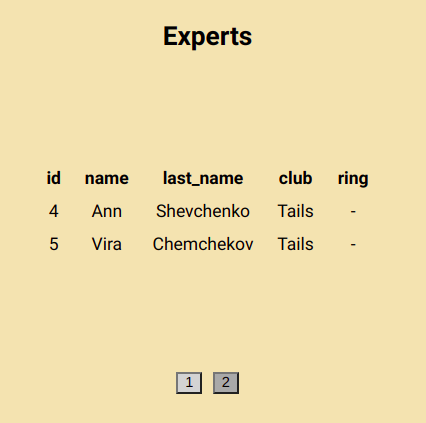

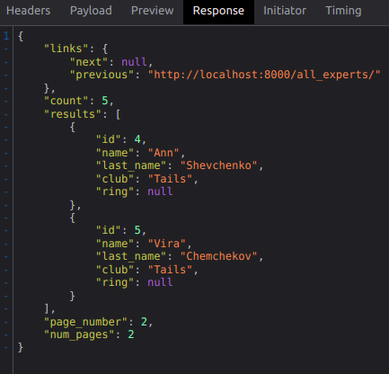

### Поиск по рингам с помощью фильтрации (порода, представленная на ринге, и тип шоу):

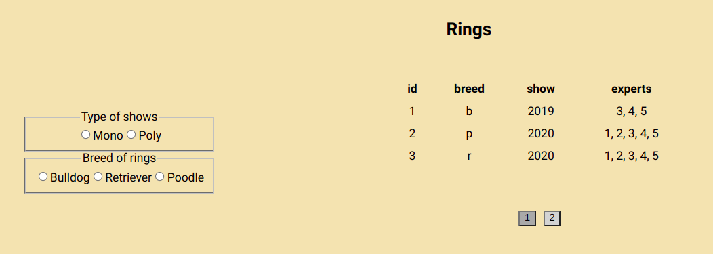

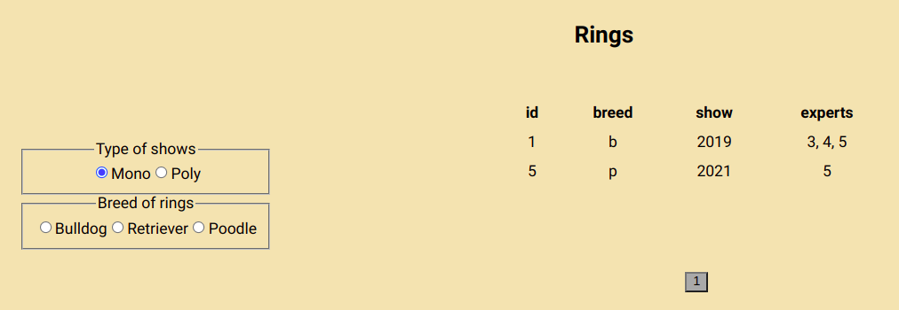

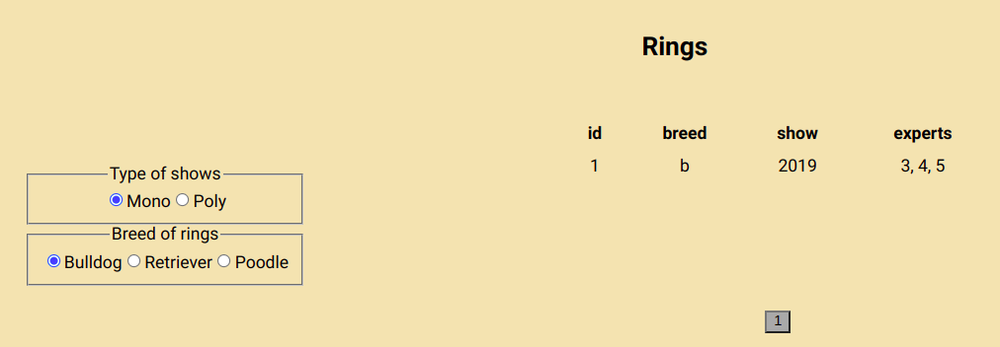

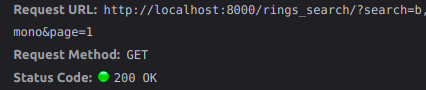